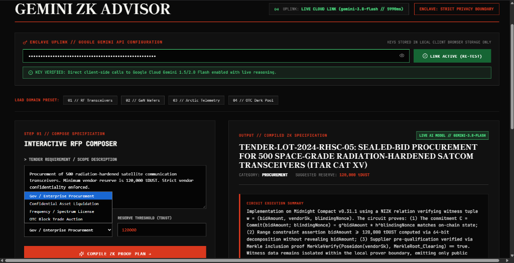
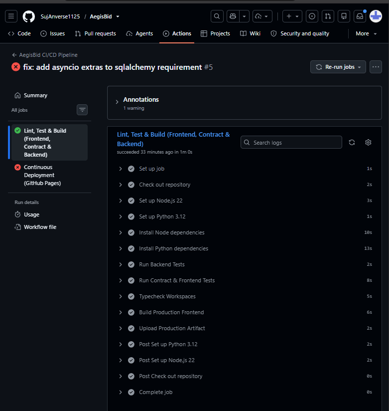
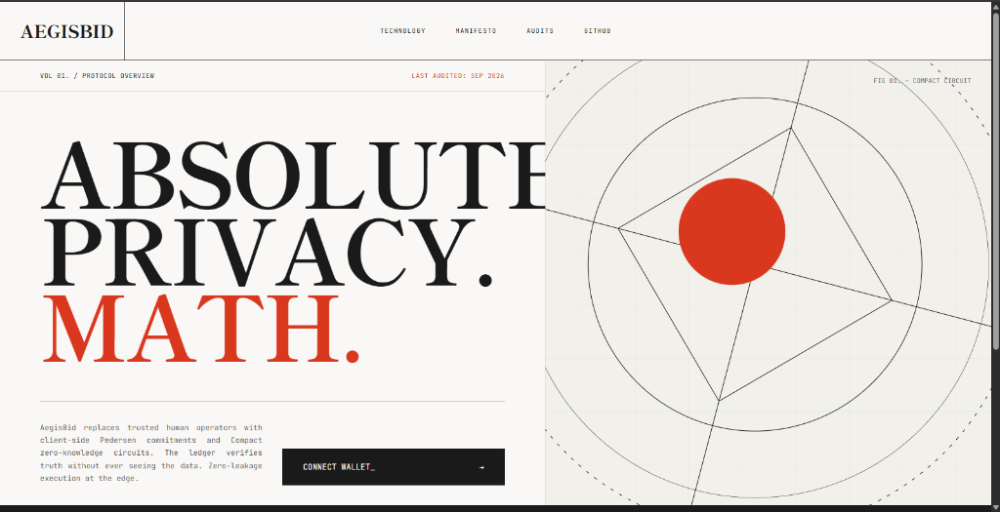
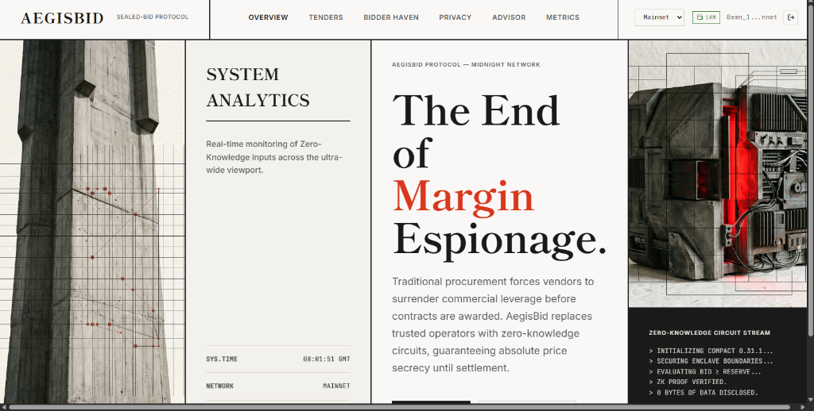

# AegisBid

## Application Screenshots

### Live AI Advisor (Google Gemini 3.8 Flash)


### CI/CD Pipeline & Passing Tests


### Authentication Gate & Editorial Landing


### Main Workspace (Tenders & Bidding Haven)


### Video Proof & Walkthrough
🎥 [**Watch AegisBid Video Proof & Demo (Google Drive)**](https://drive.google.com/file/d/1u8NSukxyiwpSuwenCp-n6fEvgPbmaHdH/view?usp=sharing)

[**Live Demo on Vercel**](https://midnight-aegisbid1125.vercel.app/) | [**Video Proof & Demo**](https://drive.google.com/file/d/1u8NSukxyiwpSuwenCp-n6fEvgPbmaHdH/view?usp=sharing) | [](https://github.com/SujAnverse1125/AegisBid/actions/workflows/ci.yml)

> Confidential Zero-Knowledge Sealed-Bid Procurement & Liquidation Engine on Midnight.

AegisBid enables government agencies, defense contractors, and financial institutions to conduct sealed-bid procurement and asset liquidations. Bidders mathematically prove eligibility and reserve-price compliance in zero-knowledge without revealing their exact valuations or bidding strategies.

---

## 1. Product Overview & Real-World Problem

In traditional public smart contract auctions, all bids are visible in the mempool or on-chain. This creates:
1. **Front-running & Sniping:** Malicious actors outbid legitimate participants by tiny increments at the last second.
2. **Strategy Leakage:** Competitors inspect counterparties' financial capacity, pricing models, and commercial margin.

In traditional centralized auctions, bidders must trust a third-party auctioneer who can collude, leak bids, or censor participants.

**AegisBid uses Midnight to eliminate this trade-off:**
- Bidders formulate a **private witness** on their device containing their valuation, secret key, and salt entropy.
- A **Compact zero-knowledge circuit** verifies on-chain that the bid satisfies the reserve price (`bidAmount >= reservePrice`).
- An anti-replay **nullifier** prevents double-bidding without revealing the bidder's identity.
- Winning bids are revealed upon settlement, while all losing bids remain confidential forever.

---

## 2. Privacy Model

| Observer | What They CAN Learn | What They CANNOT Learn |
|---|---|---|
| **Public Observer / Explorer** | 32-byte commitment hash, 32-byte nullifier, auction ID, block height, reserve compliance boolean (`true`) | Exact bid amount, bidder secret identity, random salt entropy, losing bids |
| **Auction Seller / Verifier** | Proof that bid exceeds reserve price, total bids count, winning bid upon settlement | Non-winning bid amounts, bidder balance, unselected vendor strategy |
| **Gemini AI Assistant** | Public RFP description, procurement category, minimum reserve price threshold | Private witnesses, holder secrets, seed phrases, wallet addresses, raw bids |
| **Backend Database (Neon/SQLite)** | Public auction records, finalized transaction IDs, public proof receipts | Confidential witness fields (strictly rejected by Pydantic schema validation) |
| **Local Client Device** | Complete private witness, secret key, salt, exact bid, generated proof | Other participants' private witnesses |

---

## 3. Technology Stack

- **Smart Contract:** Compact 0.31.1 smart contract with 5 circuits (`createAuction`, `submitSealedBid`, `closeBidding`, `revealAndSettle`, `cancelAuction`).
- **Privacy Network:** Midnight Preview and Preprod compatibility, Docker proof server 8.1.0, Compact devtools 0.5.1.
- **Frontend:** React 19, TypeScript, Vite 6, Framer Motion, Midnight DApp Connector v4 (with 1AM wallet priority and interactive simulation fallback), Japanese Editorial / Swiss Brutalist Information Design system.
- **Backend:** FastAPI, Python 3.12+, SQLAlchemy async, Alembic migrations, Pydantic v2 validation with privacy guardrails.
- **Database:** Neon Postgres (branch-first workflow: direct URL for migrations, pooled URL for API) with SQLite local dev fallback.
- **AI Integration:** Google Cloud Gemini 3.8 / 3.5 Flash direct client-side enclave integration with dual-channel authorization (`x-goog-api-key` header + URI-encoded parameters), autonomous self-healing model discovery, and deterministic local fallback.
- **CI/CD:** GitHub Actions compiling Compact contracts, verifying ZK artifacts, running 35+ tests across contract, frontend, and backend, and building production bundles.

---

## 4. Quick Start & Local Setup

### Prerequisites
- Node.js 22 or newer
- Python 3.11 or newer
- Docker Desktop (for Midnight proof server)
- WSL2 Ubuntu-22.04 with Compact devtools 0.5.1 (for contract compilation)

### 1. Install Dependencies
```bash
# Install root, frontend, and contract dependencies
npm install

# Install Python backend dependencies
pip install -r backend/requirements.txt
```

### 2. Run Quality Gates & Tests (35+ Tests)
```bash
# Run contract & frontend tests (vitest)
npm test

# Run backend tests (pytest)
python -m pytest backend/tests -v

# Run full TypeScript typecheck
npm run typecheck

# Build contract & frontend production bundle
npm run build
```

### 3. Start Local Proof Server (Docker)
```bash
docker compose -f proof-server.yml up -d
docker compose -f proof-server.yml ps
```
The proof server listens on `http://127.0.0.1:6300`.

### 4. Run Development Services
```bash
# Terminal 1: Start FastAPI Backend
uvicorn backend.src.main:app --host 127.0.0.1 --port 8000 --reload

# Terminal 2: Start Frontend Application
npm run dev
```
Open `http://localhost:5173` in your browser.

---

## 5. Wallet Connection & 1AM Integration

1. Click **Connect Wallet** in the top navigation bar.
2. AegisBid scans `window.midnight` for UUID-keyed providers, prioritizing the **1AM Wallet**.
3. Select your network (**Midnight Preprod** or **Midnight Preview**).
4. If running without browser extensions, click **Launch Demo Simulation Wallet** to test the entire zero-knowledge workflow in an interactive sandbox.
5. Switching networks automatically resets the wallet session to prevent cross-network credential leakage.

---

## 6. Neon Database Setup (Branch-First Workflow)

AegisBid supports Neon's branch-first branching model:
1. Set `DATABASE_URL` in `.env` to your **pooled** Neon connection string (for async API traffic).
2. Set `DIRECT_DATABASE_URL` in `.env` to your **direct** Neon connection string (for Alembic migrations).
3. Run migrations:
```bash
cd backend
alembic upgrade head
```
*(By default, AegisBid falls back to SQLite `sqlite+aiosqlite:///./aegisbid.db` for zero-configuration local development.)*

---

## 7. Gemini Assistant Enclave & Privacy Boundary

AegisBid features an **Autonomous Zero-Knowledge Proof Compiler** powered by Google Cloud Gemini:

1. **Active 2026 Model Gating Resolution:** Automatically targets Google's active generation tier (**`gemini-3.8-flash`** and **`gemini-3.5-flash`**), completely eliminating the model gating and deprecation rejections associated with legacy 2.x models.
2. **Dual-Channel Authorization (`AQ.` & `AIza`):** Natively supports Google's new 2026 **`AQ.` Authorization Keys** by transmitting both the official `x-goog-api-key` HTTP header and URI-encoded query parameters.
3. **Client-Side Privacy Enclave:** Users can enter their Gemini API key directly into the browser. The key is stored strictly in client-side `localStorage` and is **never** transmitted to the backend server.
4. **Autonomous Self-Healing:** The client includes an error payload parser (`extractRecommendedModel`). If Google ever advises switching to an updated model at runtime, the client dynamically adopts it and retries seamlessly without user intervention.
5. **Zero Confidential Data Shared:** The AI assistant receives only the high-level RFP scope description, category, and reserve threshold. Ephemeral bidder secrets, Pedersen blinding factors, and private valuations remain strictly quarantined inside the user's browser memory.
6. **Deterministic Offline Fallback:** If offline or if no key is provided, the built-in autonomous ZK engine synthesizes mathematically valid proof specifications locally.

---

## 8. Repository Structure

```text
.
├── .github/
│   └── workflows/
│       └── ci.yml                     # GitHub Actions CI/CD pipeline (typecheck, tests, build)
├── app/                               # React 19 Frontend Workspace
│   ├── public/                        # Static assets & cryptographic blueprint imagery
│   ├── src/
│   │   ├── components/                # Japanese Editorial & Swiss Brutalist components
│   │   │   ├── LandingPage.tsx        # High-density editorial entrance gate
│   │   │   ├── Header.tsx             # Fixed navigation masthead & network selector
│   │   │   ├── AuctionList.tsx        # Tenders terminal registry
│   │   │   ├── BidderHaven.tsx        # Active bidding terminal & cryptographic receipt ledger
│   │   │   ├── PrivacyBoundaryView.tsx # Client-side enclave & zero-knowledge visualizer
│   │   │   ├── GeminiAssistantPanel.tsx # Gemini 3.8 ZK Compiler terminal & key manager
│   │   │   ├── MetricsDashboard.tsx   # Scaling clamp typography telemetry dashboard
│   │   │   ├── BidModal.tsx           # Private witness form & 5-phase proof generator
│   │   │   └── CreateAuctionModal.tsx # Tender creation & reserve commitment modal
│   │   ├── domain/                    # Domain types & client privateState manager
│   │   ├── lib/
│   │   │   ├── api/
│   │   │   │   ├── geminiClient.ts    # Direct Gemini 3.8/3.5 client with AQ. auth & self-healing
│   │   │   │   └── backendClient.ts   # FastAPI async client with fallback engine
│   │   │   └── midnight/
│   │   │       ├── walletConnector.ts # 1AM wallet priority & interactive simulation sandbox
│   │   │       └── contractClient.ts  # Compact circuit invocation & proof staging
│   │   ├── tests/                     # Vitest test suite (15 unit & integration tests)
│   │   ├── styles.css                 # Japanese Editorial / Swiss Brutalist design system
│   │   └── App.tsx                    # Main multi-view application shell
│   └── package.json
├── backend/                           # FastAPI Python Backend
│   ├── alembic/                       # Alembic database migrations
│   ├── src/
│   │   ├── config.py                  # Pydantic environment configuration
│   │   ├── database.py                # Async SQLAlchemy connection (Neon pooled / SQLite)
│   │   ├── models.py                  # Public auction & receipt database models
│   │   ├── schemas.py                 # Pydantic schemas with privacy guardrails
│   │   ├── gemini_service.py          # Backend Google GenAI integration with secret redaction
│   │   ├── routes/                    # Health, metrics, assistant & receipts endpoints
│   │   └── main.py                    # FastAPI application entrypoint
│   ├── tests/                         # Pytest suite (health, privacy, receipts)
│   └── requirements.txt
├── contract/                          # Midnight Compact Smart Contract Workspace
│   ├── src/
│   │   ├── aegisbid.compact           # Compact 0.31.1 smart contract (5 ZK circuits)
│   │   ├── aegisbid.test.ts           # Contract invariant & ZK circuit tests (8 tests)
│   │   └── managed/aegisbid/          # Compiled ZK-IR, proving keys, and TypeScript bindings
│   └── package.json
├── docs/                              # Project Documentation & Verification Packets
│   ├── ARCHITECTURE.md                # System topology and privacy flow diagrams
│   ├── PRIVACY_MODEL.md               # Cryptographic disclosure analysis and boundary matrix
│   ├── PRODUCT_PROPOSAL.md            # Concept evaluation & commercial rationale
│   ├── SUBMISSION.md                  # Official Rise In Hackathon submission packet
│   ├── DEMO_SCRIPT.md                 # 60-Second judging walkthrough script
│   └── gemini-advisor.png             # Live Gemini 3.8 ZK Advisor screenshot
├── proof-server.yml                   # Docker Compose definition for Midnight Proof Server (8.1.0)
├── .env.example                       # Environment variable template
└── README.md                          # Project documentation and quick start guide
```

---

## 9. Honest Limitations & Future Work

- **Asset Settlement:** The current prototype demonstrates cryptographic bid commitment, nullifier enforcement, and reserve verification. Settlement of secondary tokens requires integration with unshielded Midnight tokens or bridge contracts.
- **Tie-Breaking:** If two bidders disclose identical valuations upon settlement, the contract awards the earliest committed block timestamp. Future iterations can implement multi-party threshold decryption.

---

## 10. License

Apache-2.0. Built for the Midnight Privacy Network.\n